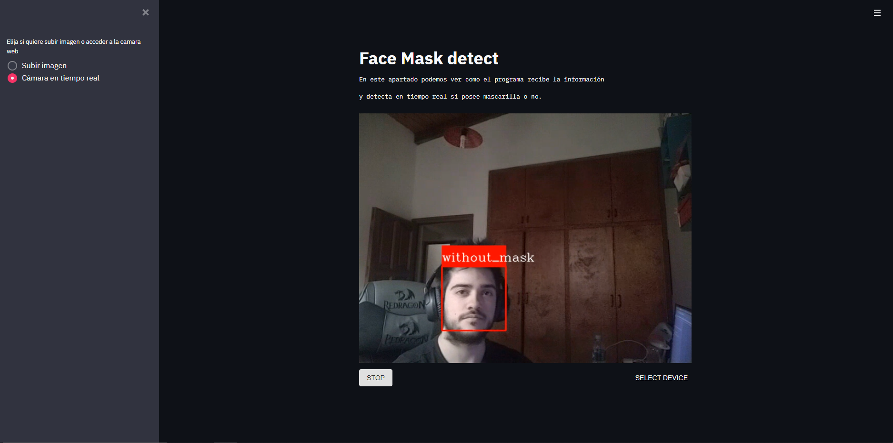
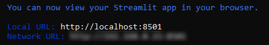

# FaceMask Detection

FaceMask Detection es un proyecto realizado con Python, Tensorflow, OpenCV y Streamlit junto al complemente de Streamlit llamado "Streamlit webrtc", usando DeepLearning para detectar rostros con y sin mascarillas en tiempo real y también en imagenes




Al ejecutar esta aplicación se abrirá una app la cual detectará los rostros directamente, detectando si el mismo posee mascarilla o no.

## Getting started

Vamos a tener que clonar el repositorio, luego vamos a tener que seguir unos pasos:

1.  Para poder ejecutar el código vamos a necesitar instalar unas ciertas librerías, las cuales están representadas en (colocar url de requiment)

1. Abra su terminal, y posiciónese en la carpeta "facemask_detection" 

1. En su terminal ejecute el siguiente comando

```bash
streamlit run facemask_app.py
```

En su consola se debería visualizar lo siguiente:


4.  Accesa a cualquiera de ambas url y disfrute del programa.

## Dataset

El dataset se divide en dos carpetas, with_mask y without_mask. Donde están las imagenes de personas con y sin mascarilla. Combiné dos datasets encontrados de internet para tener mayor imagenes de las cuales aprenda la aplicación.

- Uno de estos está hecho por:

    chandrikadeb7 chandrikadeb7@gmail.com
    https://github.com/chandrikadeb7/Face-Mask-Detection/tree/master/dataset

- Y el otro realizado por:

    Gabysol 
    https://github.com/GabySol/OmesTutorials2021/tree/main/Mascarillas%20dataset

## Objetivos

Este proyecto cuenta con objetivos a corto y mediano plazo, centrandose en su principal característica que es la detección de mascarillas.

Los objetivos a corto plazo son centrados en lo urbano y el Covid y son los siguientes:

- [x] Detectar si una persona lleva su mascarilla bien colocada
- [] Dar una señal de alerta al detectar a una persona sin mascarilla
- [] Implementar su uso en una Rasberry Pi y probar el sistema por la calle o en negocios

Y los objetivos pensados a largo plazo se centran en entornos cerrados como son laboratorios, donde se necesitan diferentes equipos de protecciones, en su mayoría una mascarilla especial para evitar inhalar gases tóxicos, estos son los objetivos planteados:

- [] Reconocimiento de distintos tipos de mascarillas en laboratorios
- [] Ampliar el reconocimiento a otros equipos de protección además de mascarilla

Las ideas sobre objetivos pueden estar en constante cambio debido a mejores ideas.

## Links de interes

https://github.com/chandrikadeb7/Face-Mask-Detection

https://github.com/Spidy20/face_mask_detection
